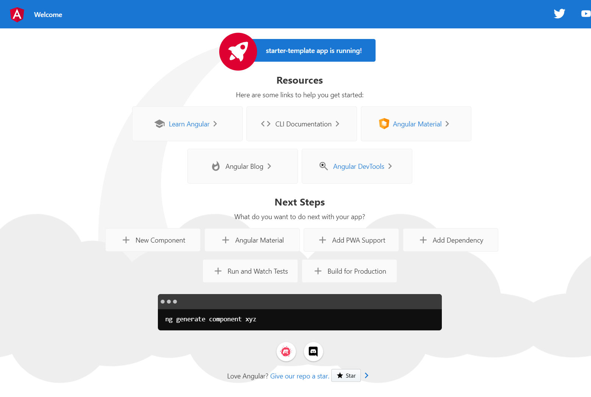

# Angular Documentation

## What is Angular ?

Angular is a frontend framework for javascript which you can use to create web applications and you can also create SPA (single page application) that will be downloaded the website engine when the user visited the page and then change it locally on the browser therefor thats so fast and provide a great user experience

## Angular developing requirements

- Install last stable version of nodejs on your system
- Install code editor for example : vs.code
- Install angular cli globally

## Create your first angular app

For create a new angular app you must open the terminal and run this command

```
ng new <app-name>
```

> Hint 1 : ng referred to angular

> Hint 2 : if you get this error **cannot be loaded because running scripts is disabled on this system** run the below command in your editor terminal

```
Set-ExecutionPolicy -Scope CurrentUser -ExecutionPolicy RemoteSigned
```

## How to run ?

Run your app with ng serve command and Then enter the localhost:4200 url on your browser. boom here you are
now you can should see this page on your browser



> Hint : the angular app port is 4200 but if you wanna change that just add the --port your-port flag on the end of your start command

## Commands

### - Run develop server

```
yarn start or ng serve
```

### - Build app for production

```
yarn build or ng build
```

### - Test app

```
yarn test or ng test
```

## Create component

### - component without separate template file in html and without test files and set standalone to true

```
ng generate component <name> --standalone --inline-template --skip-tests
```

> Hint : What is Standalone ? A Standalone component is a type of component which is not part of any Angular module. Prior to angular v14, usually when you would create a component, you'd pass it inside in the declaration array of the module.

### - component with separate template file in html and test files

```
ng generate component <name> --standalone
```

## Create a new angular interface

```
ng generate interface <name>
```

### What is Angular Interface ?

In the context of web development using the Angular framework, an **interface** refers to a TypeScript feature that helps define the structure or shape of an object. Interfaces are used to specify the contract that classes or objects must adhere to, ensuring that they have certain properties and methods.

### Purpose of Interfaces in Angular

1. **Defining Data Structures** : Interfaces are used to define the structure of objects or data models. For example, you can create an interface to describe the shape of a user object with properties like `name`, `email`, and `id`.

   ```
   interface User {
     name: string;
     email: string;
     id: number;
   }
   ```

2. **Type Checking** : Interfaces help enforce type checking. When you create a class or object that implements an interface, TypeScript checks whether all the properties and methods required by the interface are present in the class or object. This helps catch errors at compile-time.

```
class Customer implements User {
  name: string;
  email: string;
  id: number;

  constructor(name: string, email: string, id: number) {
    this.name = name;
    this.email = email;
    this.id = id;
  }
}
```

3. **Custom Types** : Interfaces can be used to create custom types, making it easier to work with complex data structures.

```
interface Point {
  x: number;
  y: number;
}

function calculateDistance(pointA: Point, pointB: Point): number {
  // Calculate distance logic here
}
```

4. **Component Input and Output** : In Angular, you often use interfaces to define the structure of data that components accept as input or emit as output through @Input and @Output decorators.

```
@Input() user: User;
@Output() selected: EventEmitter<User> = new EventEmitter<User>();
```

<!-- ## Add an input parameter to the component -->

### Angular 17 requirements

Angular v17 supports node.js versions: v18.13.0 and newer
Angular v17 supports TypeScript version 5.2 or later.
